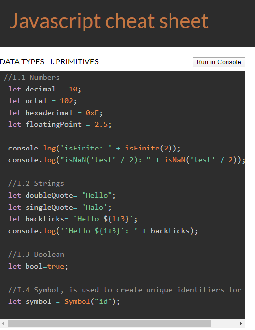

# JavaScript

In this project is a flat HTML page were I used FlexBox for creating a Javascript cheat sheet with a responsive design.

The code is also [in Codepen](https://codepen.io/beatrizsanchez/pen/JjdXwPM).

## Features

- **Examples**: Quick examples of basic concepts of JavaScript like data types, type conversions, loops...
- **Run in Console**: Check in console some instructions.

## Sources

I took inspiration from [JavaScript.info](https://javascript.info/).